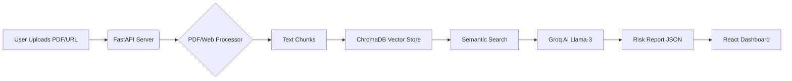

# 🚩 Deal-Breaker: AI Contract Analyzer

> **"Don't sign what you don't understand."**

**Deal-Breaker** is an intelligent document analysis tool that uses **RAG (Retrieval Augmented Generation)** to scan contracts, identify predatory clauses, and rate their safety in plain English.

---

## 🚀 Key Features and Capabilities

| Feature Category | Feature Name | Value Added |
| :--- | :--- | :--- |
| **Core Analysis** | **⚡ Instant Analysis** & **Safety Score** | Analyzes documents quickly using **Groq LPU** and assigns a 0-100 safety rating. |
| **Intelligence** | **🧠 Semantic Search** | Uses **Vector Embeddings (ChromaDB)** to find meaning, not just keywords. It knows that "Limitation of Liability" is a red flag. |
| **Advanced UX** | **Source Sync** | Implements **Split-Screen View** where clicking a risk card jumps the embedded PDF viewer to the correct source page. |
| **Actionable Output** | **Negotiator & Chatbot** | Generates professional email drafts for negotiation and supports context-aware follow-up questions. |
| **Utility** | **Multi-Modal Input** & **Export** | Supports both PDF upload and URL scraping (TOS). Includes final report export to PDF. |
| **Security** | **🔒 Privacy First** | Runs locally with a self-destructing vector store session. |

---

## 🛠️ Technical Architecture & Stack

### **Backend (Python)**

| Component | Library | Role |
| :--- | :--- | :--- |
| **Framework** | **FastAPI** | High-performance Async API server. |
| **AI Engine** | **LangChain + Groq** (`llama-3.3-70b-versatile`) | Fast, low-latency LLM for complex reasoning and drafting. |
| **Vector DB** | **ChromaDB** | Local, persistent vector store for semantic context. |
| **Parsing** | `pypdf` / `beautifulsoup4` | Handles PDF text extraction and web scraping. |

### **Frontend (React)**

| Component | Technology | Role |
| :--- | :--- | :--- |
| **Framework** | **Vite + React** | Modern, fast single-page application (SPA) environment. |
| **Styling** | **Tailwind CSS** | Utility-first framework for responsive and professional UI polish. |
| **Viewer** | `react-pdf` | Renders and syncs the PDF document in the browser. |

---

## ⚙️ Installation & Execution Guide

### **Prerequisites**
* **Git** (for cloning)
* **Node.js** (v18+)
* **Python** (v3.10+)
* **Groq API Key** (for LLM services)

### **1. Setup and Installation**

```bash
# 1. Clone the repository
git clone [https://github.com/jainik15/deal-breaker.git](https://github.com/jainik15/deal-breaker.git)
cd deal-breaker

# 2. Backend Setup
cd backend

# Create Virtual Environment
python -m venv venv

# Activate Venv (Windows)
venv\Scripts\activate
# Activate Venv (Mac/Linux)
source venv/bin/activate

# Install Dependencies
pip install -r requirements.txt

# Create .env file (Contains your API Key)
echo "GROQ_API_KEY=your_actual_key_here" > .env
```
### **2. Running the Project (Local Execution)**
The project is configured to start both servers in isolated sessions using a single script:

```
# Double-click the start.bat file in the main project folder.

# --- Equivalent Manual Commands ---
# 1. Start Backend (In isolated window)
start cmd /k "cd backend && call venv\Scripts\activate && uvicorn app.main:app --reload"

# 2. Start Frontend (In isolated window)
start cmd /k "cd frontend && npm run dev"

# Access the application in your browser: http://localhost:5173
```
---

## **🧩 System Architecture**



---

## **🛡️ License**

This project is for educational purposes only. It does not constitute real legal advice.


